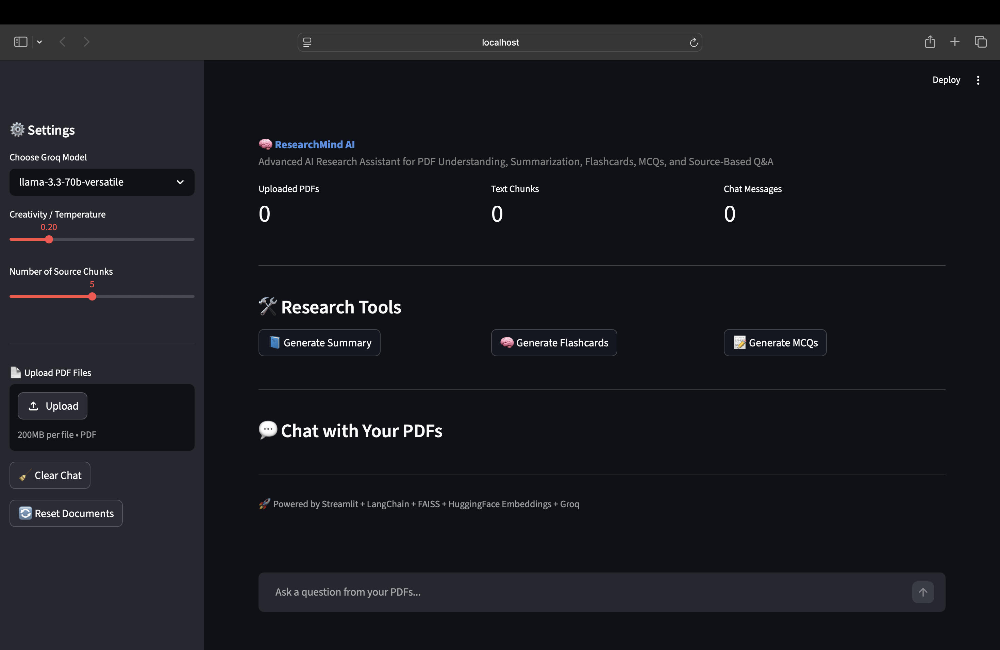
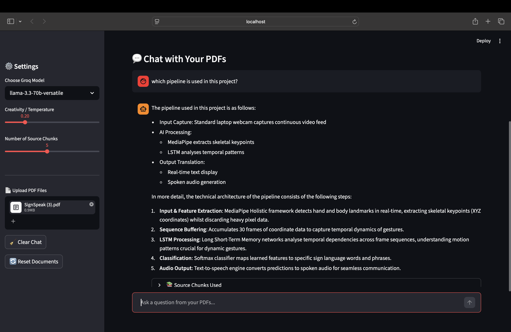
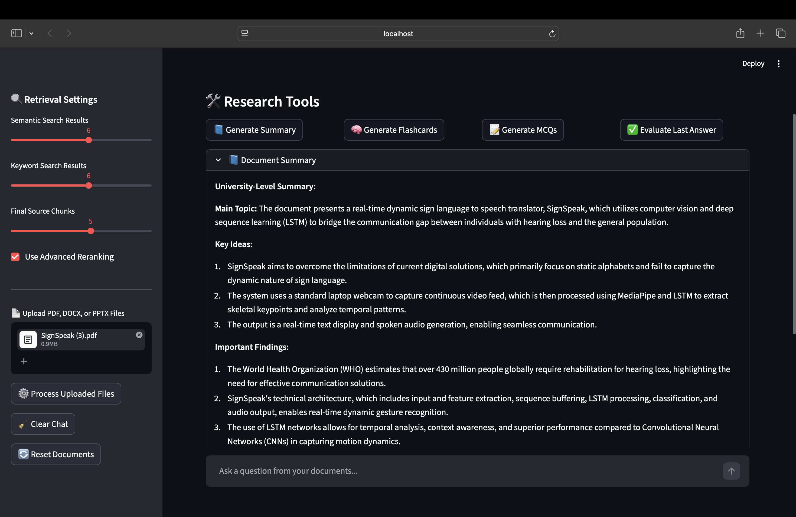
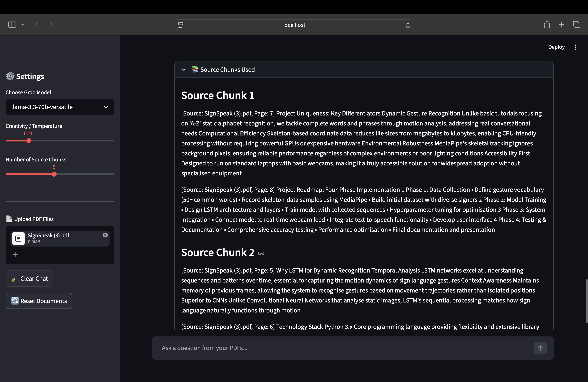
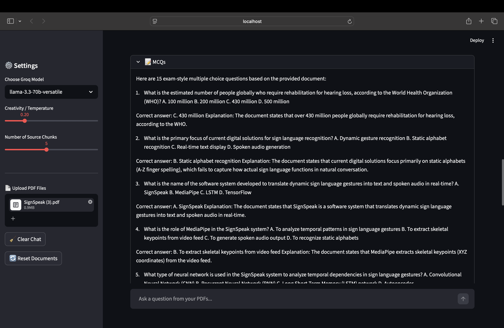
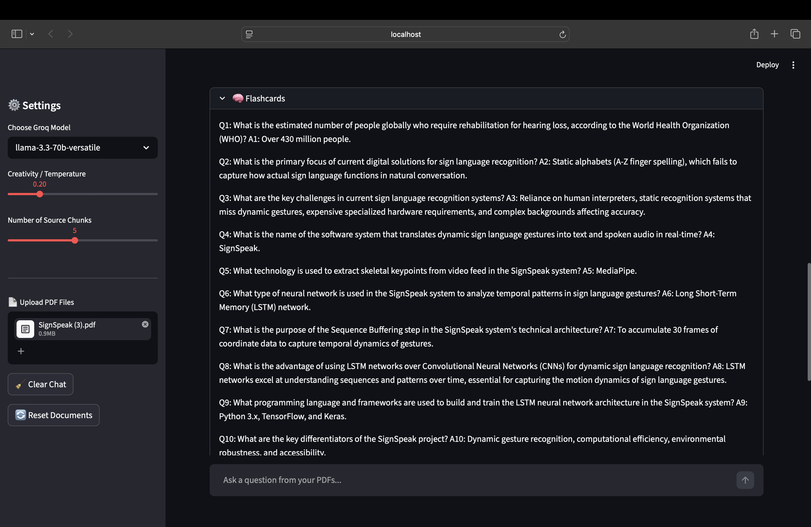

# 🧠 ResearchMind AI

ResearchMind AI is an advanced AI-powered research assistant that allows users to upload PDF documents and interact with them through intelligent question-answering, summarization, flashcard generation, MCQ generation, and source-based retrieval.

This project uses Retrieval-Augmented Generation (RAG) to retrieve relevant content from uploaded PDFs and generate accurate answers using large language models.

---

## 🚀 Features

- 📄 Upload multiple PDF documents
- 💬 Chat with PDFs using natural language
- 🧠 AI-powered question answering
- 📘 Automatic document summarization
- 📝 MCQ generation for exam preparation
- 🧩 Flashcard generation for quick revision
- 📚 Source chunk viewer for answer verification
- 💾 Export chat history
- ⚙️ Adjustable model settings
- 🔍 FAISS-based semantic search
- 🤖 Groq LLM integration

---

## 🧠 How It Works

The system follows a Retrieval-Augmented Generation pipeline:

```text
PDF Upload
    ↓
Text Extraction
    ↓
Text Chunking
    ↓
Embeddings Generation
    ↓
FAISS Vector Database
    ↓
User Query
    ↓
Semantic Search
    ↓
LLM Response Generation
    ↓
Answer with Source Chunks


## 📸 Screenshots

### Home Page


### PDF Chat


### Summary Feature


### Source Chunks



### MCQ Feature


### Flashcard Feature
