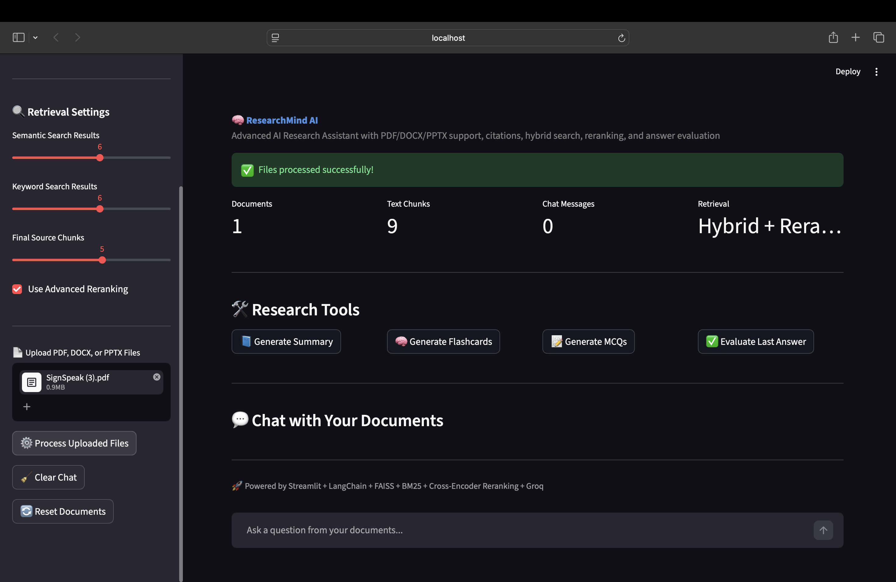
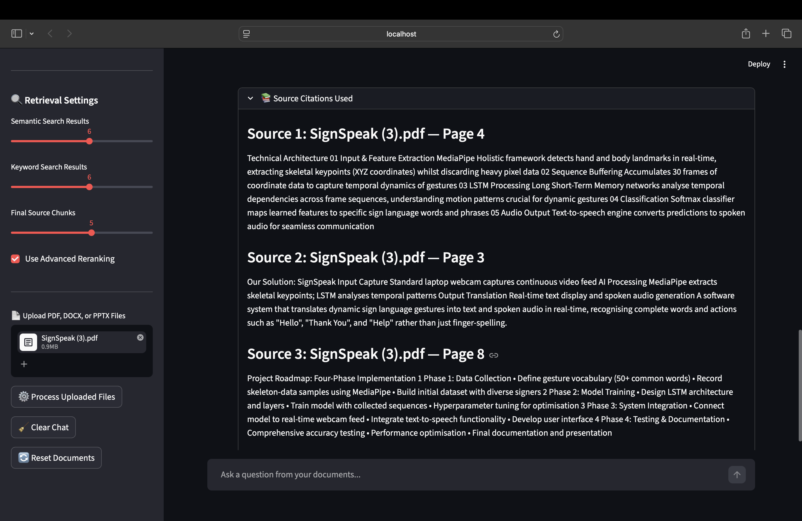
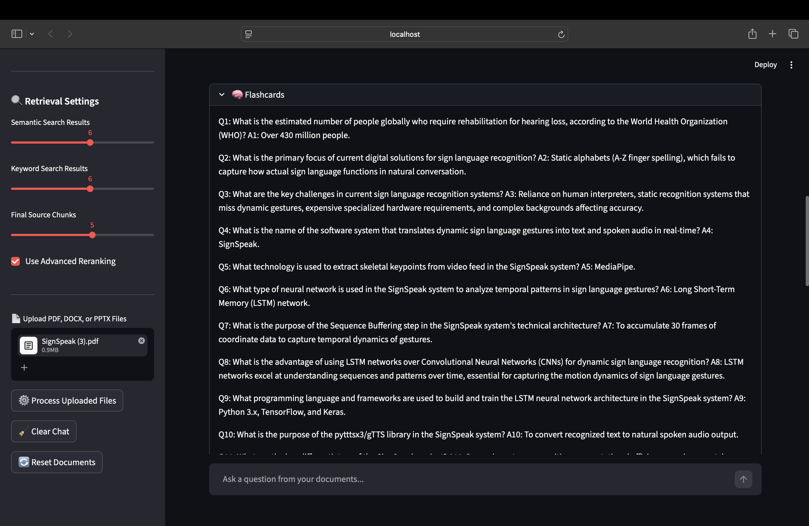
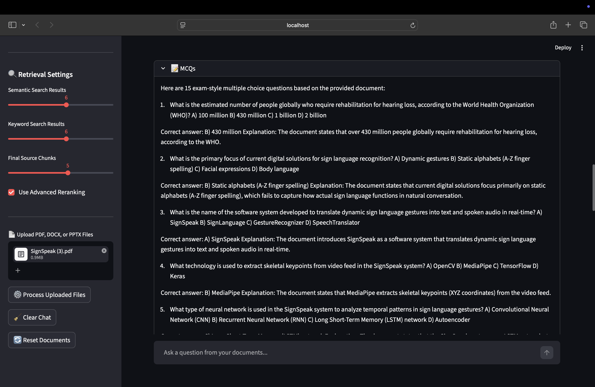

# 🧠 ResearchMind AI

ResearchMind AI is an advanced AI-powered research assistant that helps users upload academic documents and interact with them through natural language.

It supports document question-answering, summarization, flashcard generation, MCQ generation, source-based answers, hybrid search, reranking, and answer evaluation.

This project is built using Retrieval-Augmented Generation (RAG), where the system retrieves relevant document content before generating answers using a Large Language Model.

---

## 🚀 Features

### 📄 Document Upload
- Upload PDF files
- Upload DOCX files
- Upload PPTX files
- Supports multiple document uploads

### 💬 Chat with Documents
- Ask questions from uploaded documents
- Get AI-generated answers based only on document content
- ChatGPT-style interface using Streamlit chat components

### 📚 Source-Based Answers
- Shows source chunks used for answering
- PDF answers include page-based source references
- PPTX answers include slide-based source references
- DOCX answers include document-level source references

### 🔍 Advanced Retrieval
- FAISS-based semantic search
- BM25 keyword search
- Hybrid search combining semantic + keyword retrieval
- Cross-Encoder reranking for better answer relevance

### 🛠️ Research Tools
- Generate document summaries
- Generate flashcards for revision
- Generate MCQs for exam preparation
- Evaluate answer quality using an AI evaluator

### 💾 Export
- Export chat history as a `.txt` file

### ⚙️ Custom Settings
- Choose Groq model
- Adjust temperature/creativity
- Adjust number of semantic search results
- Adjust number of keyword search results
- Enable or disable reranking

---

## 🧠 How It Works

ResearchMind AI follows an advanced RAG pipeline:

```text
Document Upload
    ↓
Text Extraction
    ↓
Text Chunking
    ↓
Embedding Generation
    ↓
FAISS Semantic Search
    ↓
BM25 Keyword Search
    ↓
Hybrid Retrieval
    ↓
Cross-Encoder Reranking
    ↓
Context Selection
    ↓
Groq LLM Response
    ↓
Answer with Source Chunks
```

---

## 🛠️ Tech Stack

| Component | Technology |
|---|---|
| Programming Language | Python |
| Frontend | Streamlit |
| LLM Provider | Groq |
| LLM Framework | LangChain |
| Vector Database | FAISS |
| Embeddings | HuggingFace Sentence Transformers |
| Semantic Search | FAISS |
| Keyword Search | BM25 |
| Reranking | CrossEncoder |
| PDF Processing | PyPDF |
| DOCX Processing | python-docx |
| PPTX Processing | python-pptx |
| Environment Variables | python-dotenv |

---

## 📂 Project Structure

```text
ResearchMind-AI/
│
├── app.py
├── README.md
├── requirements.txt
├── .env.example
├── .gitignore
├── assets/
└── screenshots/
```

---

## ⚙️ Installation

### 1. Clone the repository

```bash
git clone https://github.com/tejasatl/ResearchMind-AI.git
cd ResearchMind-AI
```

### 2. Create a virtual environment

For Mac/Linux:

```bash
python3 -m venv venv
source venv/bin/activate
```

For Windows:

```bash
python -m venv venv
venv\Scripts\activate
```

### 3. Install dependencies

```bash
pip install -r requirements.txt
```

### 4. Create `.env` file

Create a `.env` file in the project root folder:

```env
GROQ_API_KEY=your_groq_api_key_here
```

Do not upload your `.env` file to GitHub.

### 5. Run the app

```bash
streamlit run app.py
```

---

## 📦 Requirements

Your `requirements.txt` should contain:

```txt
streamlit
pypdf
python-docx
python-pptx
langchain
langchain-community
langchain-core
langchain-text-splitters
sentence-transformers
faiss-cpu
python-dotenv
langchain-groq
rank-bm25
```

---

## 🔑 API Key Setup

This project uses Groq API.

Steps:

1. Go to Groq Console
2. Create an API key
3. Add the key inside `.env`

```env
GROQ_API_KEY=your_groq_api_key_here
```

Never expose your API key publicly.

---

## 📸 Screenshots

### Home Page


### PDF Upload


### Chat Response


### Source Chunks


### Summary Feature


### Flashcards


### MCQ Generator



----

## 🎯 Use Cases

- Research paper understanding
- Academic note summarization
- Lecture PDF analysis
- Exam preparation
- Flashcard generation
- MCQ practice
- Technical document Q&A
- PPT-based learning
- DOCX report analysis

---

## 🧪 Answer Evaluation

ResearchMind AI includes an answer evaluation system that checks:

- Groundedness
- Completeness
- Accuracy concerns
- Missing information
- Suggestions for improvement

This helps improve trust and reliability in generated answers.

---

## 🔍 Retrieval Methods

### Semantic Search
Uses FAISS and sentence-transformer embeddings to find meaning-based matches.

### Keyword Search
Uses BM25 to find important keyword-based matches.

### Hybrid Search
Combines semantic search and keyword search.

### Reranking
Uses a CrossEncoder model to reorder retrieved chunks based on relevance.

---

## 📌 Current Limitations

- DOCX files do not provide fixed page numbers
- PPTX citations are slide-based
- Very large documents may take longer to process
- The app depends on Groq API availability
- Image-only scanned PDFs may not extract text properly

---

## 🚀 Future Improvements

- Add OCR support for scanned PDFs
- Add persistent database storage
- Add user authentication
- Add saved document history
- Add deployment on Streamlit Cloud
- Add better citation formatting
- Add document comparison feature
- Add research paper recommendation system
- Add export to PDF/DOCX
- Add advanced analytics dashboard

---

## 🧑‍💻 Author

**Tejas Singh**  
B.Tech CSE Student  
VIT Bhopal University  

GitHub: [tejasatl](https://github.com/tejasatl)

---

## 📜 License

This project is open-source and created for learning, research, and academic portfolio development.